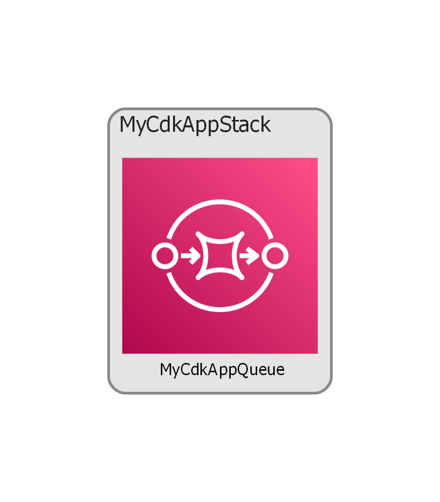

# Following through chapter 1 of the CDK Book



- This project shows how to use the task.json to create build jobs
```
Similarly, you can add default tests tasks, or any other task and invoke them
on demand, as compared to opening a terminal and fumbling through the
commands and flags. Committing the tasks.json makes this config
available to anyone who has cloned the repo, providing a consistent
experience for people using VS Code.
```

Readme best practices:

- A diagram of what your CDK application will produce. cdk-dia can be used to render this from a sample application synthesis.
- How to execute the application if it is environment specific (needs AWS access for Vpc.fromLookup() or similar)

## Generate Architecture Diagram

Follow instructions to add cdk-dia to your CDK project see docs from the [cdk-dia github](https://github.com/pistazie/cdk-dia)

Synth 
```
aws sso login --profile sg-dev
cdk synth sg-blog-api-feat-1008-app --profile sg-dev
```

Generate a CDK-DIA diagram PNG
```
npx cdk-dia
```